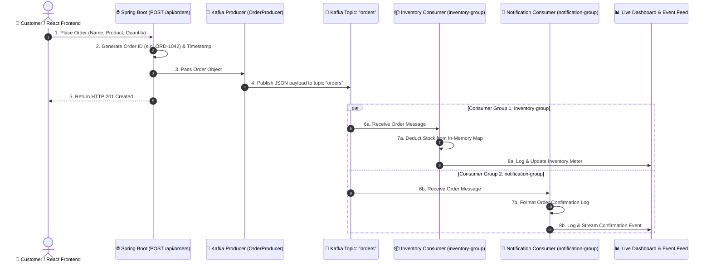

# Real-Time Order Processing System using Apache Kafka

> **A Lightweight College Mini Project demonstrating Event-Driven Architecture, Apache Kafka Topics, Producers, and Dual Independent Consumer Groups.**

---

## 📌 Project Overview

This project is a clean, full-stack, beginner-friendly application designed to demonstrate **Apache Kafka** in the easiest and most practical way possible.

When a customer places an order on the React frontend, the Spring Boot backend generates a unique Order ID and publishes the complete order payload to an Apache Kafka topic named `orders`. Two separate Kafka consumers—belonging to different consumer groups—listen to the same topic and process the event independently:

1. **Inventory Consumer (`inventory-group`)**: Automatically deducts the purchased item quantity from an in-memory inventory store (`ConcurrentHashMap`) and logs remaining stock.
2. **Notification Consumer (`notification-group`)**: Simulates dispatching an order confirmation notification to the customer and logs customer receipt details.

### Key Highlights
* **Zero Database Overhead**: Uses Java In-Memory collections (`ConcurrentHashMap` and `CopyOnWriteArrayList`). No MySQL, MongoDB, Redis, or Firebase required.
* **Dual Consumer Architecture**: Illustrates Kafka's Publish-Subscribe model where multiple services independently react to the same event without coupling.
* **Dual Run Mode (Docker & Zero-Install Embedded)**: Run with Docker Compose (`docker-compose up -d`) OR run directly using the built-in embedded Kafka fallback for stress-free viva presentations.
* **Orange & White Modern UI**: Built with React, Vite, and Tailwind CSS, featuring live dashboard cards, order submission form, real-time event feed, and inventory meters.
* **WhatsApp Click-to-Chat Notifications**: Zero-API universal `wa.me` links generated asynchronously by the Kafka `NotificationConsumer` to send order confirmations directly on WhatsApp.

---

## 🏗️ System Architecture



---

## 📂 Project Structure

```text
KAFKA Mini Project/
├── docker-compose.yml              # Starts Zookeeper & Kafka Broker (port 9092)
├── README.md                       # Complete documentation & Viva Guide
│
├── backend/                        # Java Spring Boot 3 Backend
│   ├── mvnw.cmd                    # Maven wrapper script
│   ├── pom.xml                     # Dependencies: Spring Web, Spring Kafka, Jackson
│   └── src/main/
│       ├── resources/
│       │   └── application.yml     # Kafka bootstrap config & topic settings
│       └── java/com/orderprocessing/
│           ├── OrderProcessingApplication.java   # Spring Boot Main Class
│           ├── config/
│           │   ├── CorsConfig.java               # CORS for React frontend
│           │   └── KafkaTopicConfig.java         # Creates 'orders' topic & embedded fallback
│           ├── controller/
│           │   └── OrderController.java          # REST Endpoints (/api/orders, /api/inventory)
│           ├── producer/
│           │   └── OrderProducer.java            # KafkaTemplate publisher
│           ├── consumer/
│           │   ├── InventoryConsumer.java        # Listens to 'orders' in inventory-group
│           │   └── NotificationConsumer.java     # Listens to 'orders' in notification-group
│           ├── model/
│           │   ├── Order.java                    # Order entity & Kafka payload
│           │   └── OrderEvent.java               # Audit event for live UI feed
│           └── service/
│               └── InventoryService.java         # In-memory HashMap & ArrayList store
│
└── frontend/                       # React + Vite + Tailwind CSS Frontend
    ├── index.html                  # HTML entry point with Inter typography
    ├── package.json                # React 18, Tailwind CSS, Lucide icons
    ├── vite.config.js              # Vite server & proxy configuration
    ├── tailwind.config.js          # Orange & white color palette
    └── src/
        ├── App.jsx                 # Main state coordinator & view tabs
        ├── index.css               # Tailwind directives and custom scrollbars
        └── components/
            ├── Navbar.jsx          # Top header with cluster status badge
            ├── StatsCards.jsx      # 4 Metric cards (Orders, Stock, Latest, Topics)
            ├── OrderForm.jsx       # Customer order form with live stock checks
            ├── InventoryOverview.jsx # Visual stock meters for 4 products
            ├── LiveEventFeed.jsx   # Real-time event log stream
            ├── OrderHistory.jsx    # Table of processed orders
            ├── Toast.jsx           # Success popup notification
            └── ArchitectureModal.jsx # Interactive viva defense visual guide
```

---

## 🪑 In-Memory Inventory Products

| Product | Initial Stock | Managed By |
| :--- | :---: | :--- |
| **Office Chair** | 50 | In-Memory `ConcurrentHashMap` |
| **Sofa** | 20 | In-Memory `ConcurrentHashMap` |
| **Table** | 30 | In-Memory `ConcurrentHashMap` |
| **Study Chair** | 40 | In-Memory `ConcurrentHashMap` |

---

## 🚀 How to Run Locally

### Option A: Running with Docker (Recommended)

#### 1. Start Kafka & Zookeeper
Open a terminal in the project root:
```bash
docker-compose up -d
```
Verify containers are running:
```bash
docker ps
```
* **Zookeeper**: `localhost:2181`
* **Kafka Broker**: `localhost:9092`

#### 2. Start the Spring Boot Backend
Open a terminal in `backend/`:
```cmd
.\mvnw.cmd spring-boot:run
```
Backend will start on `http://localhost:8080`.

#### 3. Start the React Frontend
Open a terminal in `frontend/`:
```bash
npm install
npm run dev
```
Open your browser at `http://localhost:5173`.

---

### Option B: Zero-Install Embedded Mode (No Docker Required!)

If Docker is not installed on your college computer or examination lab, you do not need to install anything extra. 

The backend automatically detects whether an external Kafka broker is running on port 9092. If not detected, it starts an in-process **Embedded Apache Kafka Broker** automatically!

1. In `backend/`:
   ```cmd
   .\mvnw.cmd spring-boot:run
   ```
2. In `frontend/`:
   ```bash
   npm run dev
   ```
Everything runs smoothly with 100% genuine Kafka topics, producers, and consumers!

---

## 📡 REST API Reference

### 1. Place an Order
* **Endpoint**: `POST /api/orders`
* **Content-Type**: `application/json`
* **Sample Request**:
  ```json
  {
    "customerName": "Alice Johnson",
    "product": "Office Chair",
    "quantity": 2
  }
  ```
* **Sample Response (201 Created)**:
  ```json
  {
    "status": "SUCCESS",
    "message": "Order placed and published to Kafka topic 'orders'",
    "order": {
      "orderId": "ORD-4821",
      "customerName": "Alice Johnson",
      "product": "Office Chair",
      "quantity": 2,
      "timestamp": "2026-09-07 00:45:12",
      "status": "PLACED"
    }
  }
  ```

### 2. Get Current Inventory
* **Endpoint**: `GET /api/inventory`
* **Response**:
  ```json
  {
    "Office Chair": 48,
    "Sofa": 20,
    "Table": 30,
    "Study Chair": 40
  }
  ```

### 3. Get All Orders
* **Endpoint**: `GET /api/orders`

### 4. Get Live Event Feed
* **Endpoint**: `GET /api/events`

### 5. Reset Demo State
* **Endpoint**: `POST /api/reset`

---

## 🎓 College Viva & Defense Questions

Here are the top questions examiners typically ask for this project:

### Q1: What is Apache Kafka and why is it used?
> **Answer**: Apache Kafka is a distributed event streaming platform used for building real-time data pipelines and streaming applications. It provides high-throughput, low-latency, and fault-tolerant message passing using a publish-subscribe model.

### Q2: What is the difference between a Topic and a Partition?
> **Answer**: 
> * A **Topic** is a logical category or feed name to which records are published (in our project, the topic is `orders`).
> * A **Partition** is the physical unit of parallelism and storage. A topic is split into one or more ordered, immutable sequences of records called partitions.

### Q3: Why do we have two Consumer Groups (`inventory-group` and `notification-group`)?
> **Answer**: In Kafka, each message in a partition is delivered to **one** consumer instance within each subscribing consumer group. Because `InventoryConsumer` and `NotificationConsumer` have different consumer group IDs, **both consumers receive a copy of every single order message independently**. If they had the same group ID, Kafka would load-balance and deliver each order to only one of them!

### Q4: What is the Kafka Offset?
> **Answer**: An offset is a unique sequential integer assigned to each record within a partition. It acts as an identifier that marks the exact position of a consumer within the topic log.

### Q5: Why use Kafka over traditional synchronous REST APIs?
> **Answer**: Synchronous REST calls tightly couple services. If the notification service is slow or down, the order placement hangs or fails. Kafka provides **asynchronous decoupling**: once the order is published to Kafka, the client immediately receives a confirmation. Downstream consumers process the order at their own pace without blocking each other.
